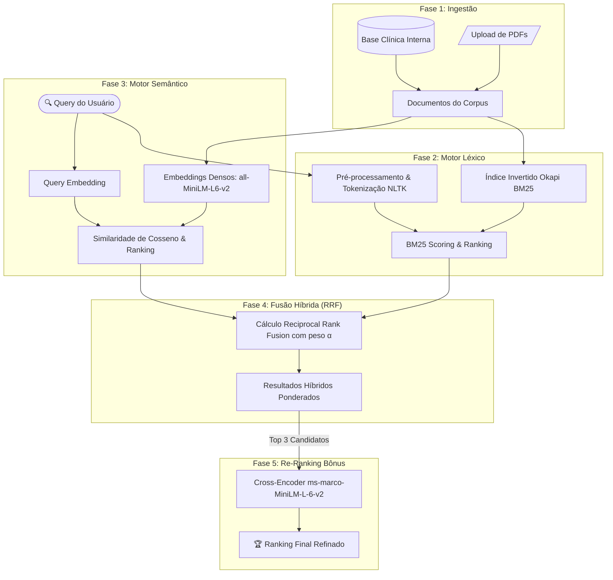

# 🏥 HealthSearch — Motor de Busca Híbrido

[](https://www.python.org/)
[](https://streamlit.io/)
[](https://huggingface.co/)
[](https://www.nltk.org/)
[](LICENSE)

> Sistema de Recuperação de Informação médica unindo **Busca Léxica (Okapi BM25)** e **Busca Semântica Vetorial (Embeddings)** através de **Reciprocal Rank Fusion (RRF)** e **Re-Ranking Neural (Cross-Encoder)**.

---

## 📌 Contexto & Motivação

Na recuperação de informações clínicas e médicas, abordagens isoladas enfrentam **pontos cegos críticos**:

* **Limitação da Busca Léxica pura (BM25 / TF-IDF):** Depende do casamento exato de termos (*exact match*). Se o médico busca por *"infarto"* e o prontuário cita apenas *"síndrome coronariana aguda"* ou *"isquemia miocárdica"*, a busca léxica zera o score de relevância e omite o documento.
* **Limitação da Busca Semântica pura (Embeddings / Cosseno):** Mapeia intenção e sinônimos no espaço vetorial denso, porém pode perder precisão em identificadores cirúrgicos, dosagens de medicamentos e códigos padronizados (como `CÓD-ECG-12D`, dosagens em `mg/kg` ou siglas específicas).

O **HealthSearch** resolve esse dilema combinando o rigor léxico do BM25 com a capacidade semântica dos modelos de linguagem, proporcionando uma experiência de busca robusta, precisa e auditável.

---

## 🚀 Funcionalidades

- [x] **Ingestão Flexível de Corpus:**
  - Base médica interna pré-carregada com diretrizes clínicas e protocolos de alta complexidade (ECG, Farmacologia Cardíaca, Hipertensão, AVC, RCP e UTI).
  - Suporte a upload dinâmico de múltiplos arquivos PDF (via `pypdf`), permitindo indexação em tempo de execução.
- [x] **Motor Léxico (Okapi BM25):**
  - Tokenização especializada, normalização e remoção de *stopwords* médicas em português (`nltk`).
  - Calibração dinâmica via interface dos parâmetros $k_1$ (saturação de frequência) e $b$ (normalização de comprimento de documento).
- [x] **Motor Semântico Vetorial:**
  - Extração de *embeddings* densos de 384 dimensões via `sentence-transformers/all-MiniLM-L6-v2`.
  - Ranqueamento por Similaridade de Cosseno entre a query e o corpus vetorial.
- [x] **Fusão Híbrida via Reciprocal Rank Fusion (RRF):**
  - Algoritmo de convergência de ranks que harmoniza ordens de grandeza distintas.
  - Controle interativo do hiperparâmetro $\alpha \in [0, 1]$ para ponderar prioridade léxica vs. semântica.
- [x] **Re-Ranking com Cross-Encoder (Desafio Bônus):**
  - Reavaliação fina dos Top-3 candidatos do RRF utilizando o modelo `cross-encoder/ms-marco-MiniLM-L-6-v2` com inferência par-a-par $(Query, Documento)$.
- [x] **Interface Analítica Completa (Streamlit):**
  - Abas independentes para inspeção transparente: Léxica, Semântica, Híbrida RRF e Matriz Comparativa.

---

## 🏗️ Arquitetura do Pipeline



---

## 📐 Fundamentação Matemática

### 1. Okapi BM25
A relevância léxica de um documento $D$ para uma consulta $Q$ é calculada por:

$$\text{Score}_{BM25}(D, Q) = \sum_{q \in Q} \text{IDF}(q) \cdot \frac{f(q, D) \cdot (k_1 + 1)}{f(q, D) + k_1 \cdot \left(1 - b + b \cdot \frac{|D|}{\text{avgdl}}\right)}$$

* $k_1$ controla a saturação da frequência do termo (padrão: $1.2$).
* $b$ controla o grau de penalização de documentos longos (padrão: $0.75$).

### 2. Similaridade de Cosseno (Semântica)
Dados os vetores densos normalizados da consulta $\mathbf{u}$ e do documento $\mathbf{v}$:

$$\text{Sim}(\mathbf{u}, \mathbf{v}) = \frac{\mathbf{u} \cdot \mathbf{v}}{\|\mathbf{u}\| \|\mathbf{v}\|}$$

### 3. Reciprocal Rank Fusion (RRF)
Combina posições ordinais independentemente das escalas numéricas dos scores:

$$\text{Score}_{\text{RRF}}(d) = \alpha \cdot \left(\frac{1}{k + \text{Rank}_{\text{BM25}}(d)}\right) + (1 - \alpha) \cdot \left(\frac{1}{k + \text{Rank}_{\text{Sem}}(d)}\right)$$

Onde $k = 60$ é a constante de suavização e $\alpha \in [0, 1]$ é o peso da componente léxica.

---

## 📊 Matriz Comparativa (Estudo de Caso)

Teste empírico executado com a consulta médica: **`"infarto"`**

| ID | Documento | Rank BM25 (Léxico) | Rank Semântico | Rank Final Híbrido |
| :---: | :--- | :---: | :---: | :---: |
| **Doc 2** | Guia de Farmacologia Cardíaca | 5 | 1 | **1** |
| **Doc 6** | Procedimentos de UTI Geral | 1 | 5 | **2** |
| **Doc 3** | Diretriz de Hipertensão Arterial | 4 | 2 | **3** |

> **Análise:** O documento de Farmacologia Cardíaca (Doc 2) foca na fisiopatologia e terapêutica do IAM (*Infarto Agudo do Miocárdio*). Embora o BM25 o tenha penalizado por variações terminológicas, o motor Semântico identificou prontamente o contexto cardiológico. O algoritmo RRF corrigiu a distorção e o promoveu à **1ª posição**.

---

## 📁 Estrutura do Repositório

```text
.
├── healthsearch_app.py    # Aplicação interativa Streamlit com o pipeline completo
├── relatorio_tecnico.md   # Relatório técnico acadêmico com fundamentação teórica
├── requirements.txt       # Dependências e bibliotecas do projeto
└── README.md              # Documentação principal do projeto
```

---

## 💻 Instalação e Execução

### Pré-requisitos
* Python 3.10 ou superior
* Git instalado

### 1. Clonar o Repositório
```bash
git clone https://github.com/Heitorrk/Desafio-Integrador-HealthSearch.git
cd Desafio-Integrador-HealthSearch
```

### 2. Criar e Ativar Ambiente Virtual
* **No Windows (PowerShell):**
  ```powershell
  python -m venv .venv
  .\.venv\Scripts\Activate.ps1
  ```
* **No Linux / macOS:**
  ```bash
  python3 -m venv .venv
  source .venv/bin/activate
  ```

### 3. Instalar Dependências
```bash
pip install -r requirements.txt
```

### 4. Executar o HealthSearch
```bash
streamlit run healthsearch_app.py
```

A aplicação abrirá automaticamente no seu navegador padrão em `http://localhost:8501`.

---

## 🛠️ Tecnologias Utilizadas

* **Linguagem:** [Python 3.10+](https://www.python.org/)
* **Interface Web:** [Streamlit](https://streamlit.io/)
* **Processamento de Linguagem Natural (NLP):** [NLTK](https://www.nltk.org/)
* **Motor Léxico:** [rank-bm25](https://github.com/dorianbrown/rank_bm25)
* **Embeddings & Deep Learning:** [Sentence-Transformers](https://www.sbert.net/) (`all-MiniLM-L6-v2`)
* **Re-Ranking Neural:** [Cross-Encoder](https://www.sbert.net/examples/applications/cross-encoder/README.html) (`ms-marco-MiniLM-L-6-v2`)
* **Processamento de PDFs:** [PyPDF](https://pypdf.readthedocs.io/)
* **Manipulação de Dados:** [Pandas](https://pandas.pydata.org/) & [NumPy](https://numpy.org/)

---

## 👥 Autores & Informações Acadêmicas

* **Instituição:** UNIPÊ — Centro Universitário de João Pessoa
* **Disciplina:** Tendências em Ciência da Computação (Recuperação de Informação / NLP)
* **Professor:** Me. Ricardo Roberto de Lima

**Integrantes da Equipe:**
* Mateus Ieno Ramalho
* Heitor de Oliveira Mamede
* João Gabriel Barreto de Araújo Falcão
